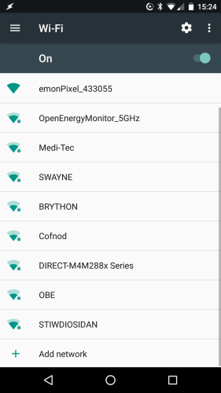
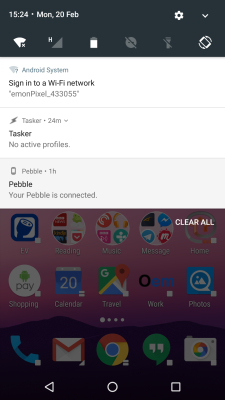
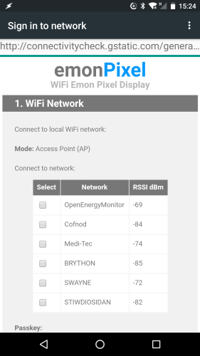
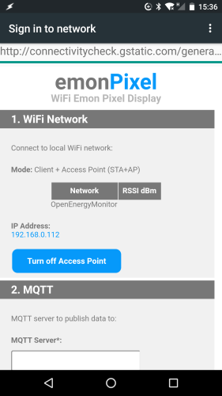
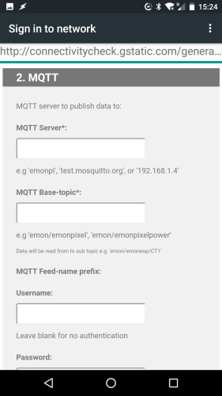

# EmonESP

[](https://travis-ci.org/openenergymonitor/emonPixel)

ESP8266 WIFI Pixel display


## Requirements

- ESP-12E module with 4M Flash
- EmonPixel

***

# EmonPixel User Guide

## First Setup

On first boot, ESP should broadcast a WiFI AP `emonPixel_XXX`. Connect to this AP and the [captive portal](https://en.wikipedia.org/wiki/Captive_portal) should forward you to the log-in page. If this does not happen navigate to `http://192.168.4.1`

*Note: You may need to disable mobile data if connecting via a Android 6 device*

### 1. WiFi Connection

#### Modes status

- Single pixel flashing red / blue: attemping to connect to WiFi network
- 3 white LED's and 6 blue: WiFi AP mode
- Single solid red pixel: Connected to Wifi network

The Pixel should illuminate all LED's in a colour pattern to indicate a normal boot mode. After a few seconds a few white LED's should light, this indicates that the WiFi Pixel is in WiFi Access Point (AP) mode.

A fresh (blank) emonPixel will starup in WiFi access point (AP), 3 white LED's and 6 blue indicate WiFi AP mode.

You should now be able to connect to the emonPixel's AP using a laptop or mobile. The network name will be emonPixel_xxxx where xxx is a number printed on the rear of the unit. When connected the phone or laptop should get automatically forward to the login portal. If this does not happen browser to http://192.186.4.1. Once connected to the login portal (it may take a few moments to load) you should see the WiFi Pixels config page:






**Note: If the unit has previously been connected to a WiFi network it will attempt to re-connect to this network. To force the unit into WiFi AP mode so we can connect direclty to it to change the WiFi config press and hold the `Boot` button during startup for about 10s until the white LED's indicate AP mode**


- Select your WiFi network from list of available networks
- Enter WiFi PSK key then click `Connect`



- emonPixel should now connect to local wifi network and return local IP address.
- The emonPixel's Access point can now be turned of by cliking the Turn off Access Point button
- Browse to local IP address by clicking the hyperlink (assuming your computer is on the same WiFi network)
On future boots emonPixel will automatically connect to this network.


*Note on some networks  (ones with MDNS) it's possible to browse to the EmonPixel using hostname [http://emonpixel.local](http://emonpixel.local), *

**If re-connection fails (e.g. network cannot be found) the EmonESP will automatically revert back to WiFi AP mode after a short while to allow a new network to be re-configued if required. Re-connection to existing network will be attempted every 5min.**





## 3. MQTT




emonPixel can be sent stuff over MQTT commands to come

- Enter MQTT server host and base-topic
- (Optional) Enter server authentication details if required
- Click connect
- After a few seconds `Connected: No` should change to `Connected: Yes` if connection is successful. Re-connection will be attempted every 10s.

### 3.1 MQTT commands
The commands are based around the following base commands

#### Background

Background specifies the background colour. Any pixels not filled by a dial in the last fill will remain this colour.

 Topic: `$basettopic`
 Message: `background/$r/$g/$b`

#### Fill command

 - **Fill clockwise:** `cdial` Illuminate clockwise. The entire pixel is set to the current background colour then filled in a clockwise direction. If the number to be displayed is larger than can be displayed by the pixel then it will fill completely, blank and then continue to fill

 Topic: `$basettopic`
 Message `cdial/$r/$g/$b/$n`

*Note: after setting the background adial and or cdial must then be called to take effect*

 - **Fill anti-clockwise:** `adial` as pre cdial but the background is not reset and the fill will start from pixel 16 in an anti clockwise direction.

  Topic: `$basettopic`
  Message: `adial/$r/$g/$b/$n`

#### Individual Pixel

The command `pixel` does not reset the background and will set an individual pixel to be the specified colour:

  Topic: `$basettopic`
  Message: `$basettopic pixel/$r/$g/$b`

  This will draw a clockwise dial starting from the 0th pixel (12 o'clock')
  Each pixel will be illuminated to the colour specified by $r $g $b the $n will dictate the number of pixels illuminated and the brightness of the last pixel.
  e.g. `emonpixel/cdial/255/0/0/4` will turn the 1st pixel to 50% brightness red `emonpixl/cdial/255/0/0/24` will fill the first 2 pixels. The first pixel will be max brightness red and the second pixel will be at 50% brightness.

## 5. Admin (Authentication)

HTTP Authentication (highly recommended) can be enabled by saving admin config by default username and password

**HTTP authentication is required for all HTTP requests including input API**


## 7. System

Displays free system memory and firmware version


### MQTT server details

*MQTT user and pass are optional, leave blank for connection to un-authenticated MQTT servers*

***

## Installation

emonPixel uses [ESP8266 Arduino core](https://github.com/esp8266/Arduino)

Firmware can be compiled and uploaded either using PlatfomIO ([see blog post](https://blog.openenergymonitor.org/2016/06/platformio/)) or Arduino IDE.


### Option 1: Using PlatformIO

For more detailed ESP8266 Arduino core specific PlatfomIO notes see: https://github.com/esp8266/Arduino#using-platformio

#### 1a. Install PlatformIO command line

The easiest way if running Linux is to install use the install script, this installed pio via python pip and installs pip if not present. See [PlatformIO installation docs](http://docs.platformio.org/en/latest/installation.html#installer-script). Or PlatformIO IDE can be used :

`$ sudo python -c "$(curl -fsSL https://raw.githubusercontent.com/platformio/platformio/master/scripts/get-platformio.py)"`

#### 1b. And / Or use PlatformIO IDE

Standalone built on GitHub Atom IDE, or use PlatformIO Atom IDE plug-in if you already have Atom installed. The IDE is nice, easy and self-explanitory.

[Download PlatfomIO IDE](http://platformio.org/platformio-ide)

#### 2. Clone this repo

`$ git clone https://github.com/openenergymonitor/emonPixel`

#### 3. Compile

```
$ cd emonPixel
$ pio run
```

The first time platformIO is ran the espressif arduino tool chain and all the required libs will be installed if required.


#### 3. Upload

- Put ESP into bootloader mode
   - On  ESP boards (Adafruit HUZZAH) press and hold `GPIO0` button then press Reset, LED should light dimly to indicate bootloader mode

##### a.) Upload main program:

`$ pio run -t upload`

##### b.) Upload data folder to the file system (html, CSS etc.) (SPIFFS):

- Put ESP back into bootloder mode, see above

`$ pio run -t uploadfs`

See [PlatfomrIO docs regarding SPIFFS uploading](http://docs.platformio.org/en/latest/platforms/espressif.html#uploading-files-to-file-system-spiffs)
##### c.) upload all in one go
This wil upload both the fimware and fs in a single command

- Put ESP into bootloader mode

`esptool.py  --port /dev/tty.SLAB_USBtoUART --baud 921600  write_flash 0x000000 .pioenvs/emonpixel/firmware.bin   0x300000 .pioenvs/emonpixel/spiffs.bin`

##### d.) OTA upload over local network

`$  pio run  -t upload --upload-port <LOCAL-ESP-IP-ADDRESS>`

Upload SPIFFS filesystem over OTA (and don't flash):

` pio run -e emonesp_spiffs -t upload --upload-port <LOCAL-ESP-IP-ADDRESS>`

OTA uses port 8266. See [PlatformIO ESP OTA docs](http://docs.platformio.org/en/latest/platforms/espressif.html#over-the-air-ota-update):


#### 4. Debugging ESP subsystems

The ESP subsystems have a lot of logging that can be enabled via setting various build options.

Using Platform IO the easiest way to configure these is via the [PLATFORMIO_BUILD_FLAGS](http://docs.platformio.org/en/stable/envvars.html#envvar-PLATFORMIO_BUILD_FLAGS) environment variable.

First select the serial port to output debug;
```
-DDEBUG_ESP_PORT=Serial
-DDEBUG_ESP_PORT=Serial1
```

Then add one or more of the debug options;
```
-DDEBUG_ESP_CORE
-DDEBUG_ESP_WIFI
-DDEBUG_ESP_HTTP_CLIENT
-DDEBUG_ESP_HTTP_SERVER
-DDEBUG_ESP_HTTP_UPDATE
-DDEBUG_ESP_UPDATER
-DDEBUG_ESP_OTA
-DDEBUG_ESP_SSL
-DDEBUG_TLS_MEM
```

For example from the Windows Power shell you may do something like;
```
$env:PLATFORMIO_BUILD_FLAGS="-DDEBUG_ESP_PORT=Serial1 -DDEBUG_ESP_CORE -DDEBUG_ESP_WIFI"
pio run -t clean
pio run
pio run -t upload --upload-port 172.16.0.80
```

***

### Option 2: Using Arduino IDE

#### 1. Install ESP for Arduino IDE with Boards Manager

Install steps from: https://github.com/esp8266/Arduino

- Install Arduino IDE 1.6.8 from the Arduino website.
- Start Arduino and open Preferences window.
- Enter `http://arduino.esp8266.com/stable/package_esp8266com_index.json` into Additional Board Manager URLs field. You can add multiple URLs, separating them with commas.
- Open `Tools > Board > Board Manager`, scroll down and click on esp8266 platform, select version then install
- Select `Tools > Board > Generic ESP8266 Module` (required for EmonESP)

#### 2. Install ESP filesystem file uploader

Required to include `data` folder with HTML etc in the upload

[Follow esp8266 filesystem instructions (copied  below):](https://github.com/esp8266/Arduino/blob/master/doc/filesystem.md)

- [Download the Arduino IDE plug-in (.zip)](https://github.com/esp8266/arduino-esp8266fs-plugin/releases/download/0.2.0/ESP8266FS-0.2.0.zip)
- Navigate to the `tools` folder in your Arduino sketchbook directory, (create directory if it doesn't exist)
- Create `tools > ESP8266FS` folder
- Unpack the plug-in into `ESP8266FS` directory (the path will look like `<home_dir>/Arduino/tools/ESP8266FS/tool/esp8266fs.jar`)
- Restart Arduino IDE

#### 3. Clone this repo

`$ git clone https://github.com/openenergymonitor/emonPixel`


### Development Forum Threads

- https://community.openenergymonitor.org/t/emonpixel-firmware-development/1191/43
- https://community.openenergymonitor.org/tags/emonpixel

### License

GNU V3 General Public License


# MQTT
only one subscription callback though can subscribe to multiple sub-topics
# emonPixel
WiFi LED Pixels

#### Troubleshooting Upload

If you are experiancing ESP hanging in a reboot loop after upload it may be that the ESP flash has remnants of previous code (which may have the used the ESP memory in a different way). The ESP flash can be fully erased using [esptool](https://github.com/themadinventor/esptool). With the unit in bootloder mode run:

`$ esptool.py erase_flash`

*`sudo` maybe required*

Output:

```
esptool.py v1.2-dev
Connecting...
Running Cesanta flasher stub...
Erasing flash (this may take a while)...
Erase took 8.0 seconds
```


#### Mega DUMP
esptool can be used to program both the FS and the code in one hit from a functioning (tested) pixel
```
esptool.py read_flash  0x00000000  1400000 1,400,000 out
esptool.py   write_flash 0x00000000 out


```
